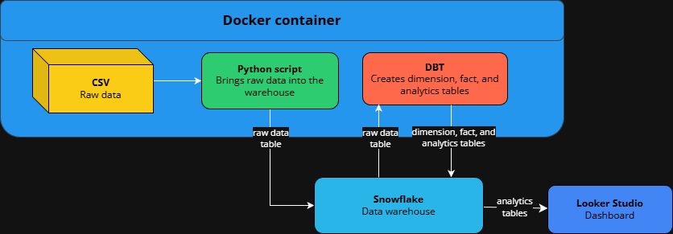

# Online Retail ETL & Analytics Pipeline

[](https://www.docker.com)
[](https://www.python.org)
[](https://www.getdbt.com/)
[](https://www.postgresql.org)
[](https://www.snowflake.com)
[](https://datastudio.google.com)



This repository contains a complete ETL/ELT pipeline for the Online Retail dataset (2009–2011).

It ingests raw CSV data, transforms it into a clean star schema using dbt, stores it in Snowflake, and generates aggregated tables for analytics. The pipeline is fully containerized with Docker, making it easy to run locally or in a cloud environment.

---

## Overview and Dashboard

- Overview of this project: [click here](https://emile-muller.alwaysdata.net/retail-etl/)
- Public dashboard: [click here](https://lookerstudio.google.com/s/ruu1v0Jwo7w)

---

## Prerequisites

### General

- Docker and Docker Compose installed
- Access to a Snowflake account and proper credentials

### Download the CSV

Download the raw CSV dataset [here](https://www.kaggle.com/datasets/mashlyn/online-retail-ii-uci), make sure to name it `online_retail_II.csv`, and add it to the `data` folder.

### Environment Variables

At the root of the project, rename the file `.env.example` to `.env`, and add your Snowflake connection details:

```env
SNOWFLAKE_ACCOUNT=<your_account>
SNOWFLAKE_USER=<your_user>
SNOWFLAKE_PASSWORD=<your_password>
SNOWFLAKE_WAREHOUSE=<your_warehouse>
SNOWFLAKE_DATABASE=<your_database>
SNOWFLAKE_SCHEMA=<your_schema>
SNOWFLAKE_ROLE=<your_role>
```

---

## Project Structure

```
.
|   .env
|   .gitignore
|   compose.yaml
|   dbt_project.yml
|   Dockerfile
|   etl_load.py
|   README.md
|   requirements.txt
|
+---data
|       online_retail_II.csv
|
+---dbt_profiles
|       .user.yml
|       profiles.yml
|
+---docs
|       data_pipeline.png
|
+---macros
|       length_equals.sql
|       price_positive.sql
|       quantity_nonzero.sql
|       schema.yml
|       two_decimals.sql
|
+---models
|   +---analytics
|   |       customer_country.sql
|   |       customer_ltv_distribution.sql
|   |       customer_order_distribution.sql
|   |       monthly_sales.sql
|   |       product_price_tiers.sql
|   |       schema.yml
|   |       top_100_customers.sql
|   |       top_100_products.sql
|   |
|   \---marts
|           customer.sql
|           product.sql
|           sales.sql
|           schema.yml
|           transaction_date.sql
```

---

## Run the data pipeline

### Start the pipeline

```
docker-compose up
```

### Build and run

```
docker-compose up --build
```

### Stop the process

```
docker-compose down
```

## Run a specific command within the container

### Run dbt models

```
docker-compose run --rm etl dbt run
```

### Debug dbt connection

```
docker-compose run --rm etl dbt debug
```

### Run dbt tests

```
docker-compose run --rm etl dbt test
```

## Open DBT documentation

```
docker-compose run --rm etl dbt docs generate
```

```
docker-compose run --rm -p 8080:8080 etl dbt docs serve --host 0.0.0.0
```

Then open http://localhost:8080 on a browser
